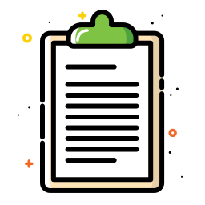

<!-- PROJECT LOGO -->

    

  <h3 align="center">Module 5 Challenge: Password Generator</h3>

  

        <a href="https://myriamartin.github.io/password-generator/"><strong>View password generator app</strong></a>
     
     
   
  

<!-- TABLE OF CONTENTS -->

  
Table of Contents

  <ol>
    <li>
      <a href="#about-the-project">About The Project</a>
      <ul>
        <li><a href="#built-with">Built With</a></li>
      </ul>
    </li>
     <li><a href="#usage">Usage</a></li>
     <li><a href="#contact">Contact</a></li>
    <li><a href="#acknowledgments">Acknowledgments</a></li>
  </ol>

<!-- ABOUT THE PROJECT -->

## About The Project

 

    

 
The password generator application allows employees to generate a random password based on criteria that they select by modifying the starter code. The app will run in the browser using JavaScript code to dynamically update HTML and CSS. With a clean and responsive user interface, it will be adaptable to different screen sizes.

Project Link: [https://myriamartin.github.io/password-generator/](https://myriamartin.github.io/password-generator/)

(<a href="#readme-top">back to top</a>)

<!-- USAGE EXAMPLES -->

## Usage

The following images illustrate the interface design and functionality of the web application:

- When the button is clicked, a password will be generated.
  - A series of questions are provided to the user regarding password criteria.
  - Password criteria is based on the password length and the character type.
    - Password length:
      - Minimum 10 characters, maximum 64 characters.
    - Character types:
      - Lowercase.
      - Uppercase.
      - Numeric.
      - Special characters ($@%&\*, etc).
  - Code should validate for each input and at least one character type should be selected.
  - Once prompts are answered, then the password should be generated and displayed in an alert or written to the page.

  
_Password generator collects data the user inputs according to criteria [Password Generator App](https://myriamartin.github.io/password-generator/)_

 

 
 
_Password generator expected behaviour [Password Generator App](https://myriamartin.github.io/password-generator/)_

 

(<a href="#readme-top">back to top</a>)

## Built With

| 
| 
| 
| 
| 

(<a href="#readme-top">back to top</a>)

<!-- CONTACT -->

## Contact

Myriam Martin EDx Student - frontend developer wannabe 🙋🏻‍♀️💻

- [@myriamartin](https://www.github.com/myriamartin)  
  Project Link: [https://myriamartin.github.io/password-generator/](https://myriamartin.github.io/password-generator/)

(<a href="#readme-top">back to top</a>)

<!-- ACKNOWLEDGMENTS -->

## Acknowledgments

- [EDx Front-End Web Development Boot camp](https://skillsforlife.edx.org/)
- [MDN Web Docs](https://developer.mozilla.org/en-US/docs/Learn/JavaScript)
- [othneildrew Best Readme Templates](https://github.com/othneildrew/Best-README-Template)
- [GitHub Pages](https://pages.github.com)
- [React Icons](https://react-icons.github.io/react-icons/search)

(<a href="#readme-top">back to top</a>)

